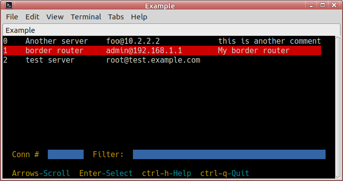

# nccm
NCurses ssh Connection Manager

Copyright (C) 2020 Kenneth Aaron.

Freedom makes a better world: released under GNU GPLv3.
https://www.gnu.org/licenses/gpl-3.0.en.html

Free for personal use (as in "at home").

Free for all non-personal use (organizational,
non-profit, government, education, commercial, etc) -
please send me an email if this software is useful to
your organization.

flyingrhino@orcon.net.nz

This software can be used by anyone at no cost, however
if you like using my software and can support - please
donate money to a children's hospital of your choice.

This program is free software: you can redistribute it
and/or modify it under the terms of the GNU General Public
License as published by the Free Software Foundation:
GNU GPLv3. You must include this entire text with your
distribution.

This program is distributed in the hope that it will be
useful, but WITHOUT ANY WARRANTY; without even the implied
warranty of MERCHANTABILITY or FITNESS FOR A PARTICULAR
PURPOSE.
See the GNU General Public License for more details.

Manual install instructions
---------------------------

Copy the script to a directory of your choice and prepare
the ssh connections yml file in one of the supported
directories.

You may need to manually install the PyYAML module:
  pip3 install --user PyYAML

You may even need to install the python pip3 program if
your distro doesn't have it.

You can do the following:
  copy the nccm script to: /usr/local/bin/
  cd /usr/local/bin/
  chmod 755 nccm
  chown root:root nccm

The script can then be run by simply typing 'nccm'
from anywhere.

The ssh connections (servers) file is loaded from the
following paths, whichever is found first:
  ~/.config/nccm/nccm.yml
  ~/.nccm.yml
  ~/nccm.yml
  /etc/nccm.yml

This program comes with an example yml file. Edit it
so suit your needs.

Controls
--------

Up/Down arrows      Scroll the list up/down
Home/End            Jump to list first/last entry
PgUp/PgDn           Page up/down in the list
Shift Up/Down       Move the marker up/down
Shift Left/Right    Move the marker to display top/bottom
Enter               Connect to the selected entry

Ctrl-h              Display this help menu
Ctrl-q or Ctrl-c    Quit the program
F1-F4 or !@#$       Sort by respective column (1-4)

Usage
-----

'Conn #' textbox:
Accepts integer values only (and !@#$ for sorting).
Pressing Enter here will connect to this connection ID,
(provided it is a valid connection number in the full
(unfiltered) connections list), ignoring everything else:
Filter textbox, highlighted line - even if they don't
match. If this textbox is empty, it will connect to the
connection marked by the highlighted line.

'Filter:' textbox:
Type any filter text here.
Accepts any printable character and space.
Text is forced to lowercase, and the resulting filtering
is case insensitive.
Pressing Enter will connect to the connection highlighed
in red. This also works if you're in the Conn textbox
and it's empty.

Textboxes accept backspace to delete one char backwards,
inline editing not supported.

Displayed connection list is filtered by the combined
contents of all the fields as you type in real time.
Spaces delimit filters if typed into 'Filter:' textbox
and all filter entries are AND'ed.

Regular direction keys (arrow up/down, home, end, pgup,
pgdn) scroll the list vertically.
Arrow left/right scroll the list horizontally if the text
is longer than the width of your window.
Shift arrow up/down scrolls the marker up/down within the
confines of your display. Shift arrow left/right jumps
the marker to the first/last visible line in your display.
The reason for doing it this way is that independant
list and marker movement usually achieves faster results
with less keypresses.

Sorting
-------

F1-F4 keys sort by the respective fields 1-4.
The Fn keys may be captured by certain GUIs so we have
an alternative - when focused on 'Conn #' window, press
shift-1 through 4 (!@#$) to toggle sorting by the
respective field number.
Pressing the same key again reverses the sort order.

Limitations
-----------

Lots...

Will not store passwords. Please don't request this
feature because it won't be added.
Either use ssh passwordless login (by placing your
public key on the server in .ssh/authorized_keys - tip:
look up ssh-copy-id) or store your password in a
password manager and paste it when prompted.

Does not like window resizing and exits gracefully
displaying an error message.
It's safe to resize the window once connection
establishment is in progress or after connected to
your server.

Does not support highlighting filter keywords in search
results because this results in a messy and confusing
display once more than a couple keywords are used.

Text entry is limited to the length of the textboxes
which in turn are dictated by the width of your window.
This should be enough for most use cases though.

Misc
----

This program aims to do one thing well - let you make SSH
connections from an ncurses based manager with minimum
distraction. I wish to avoid feature creep to keep it
on focus.

The code is heavily commented, with the hope that it will
make life easier for modders and forkers.

